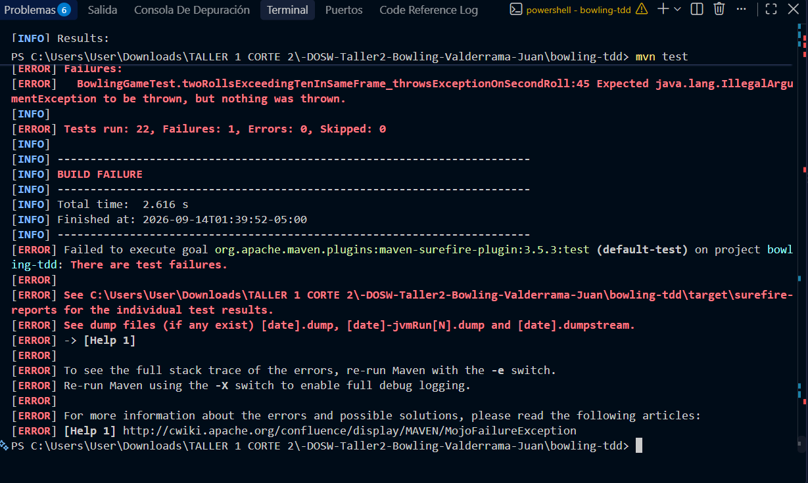
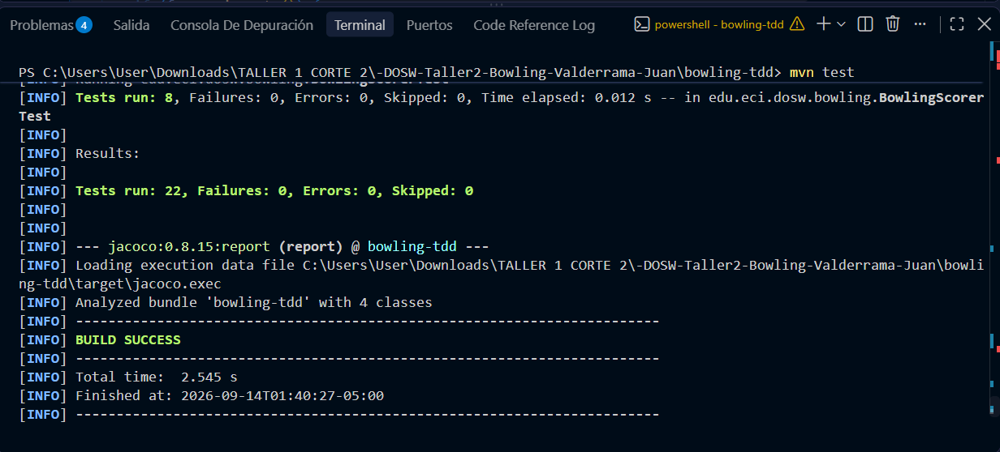
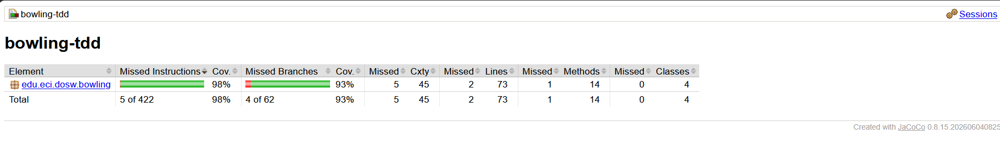
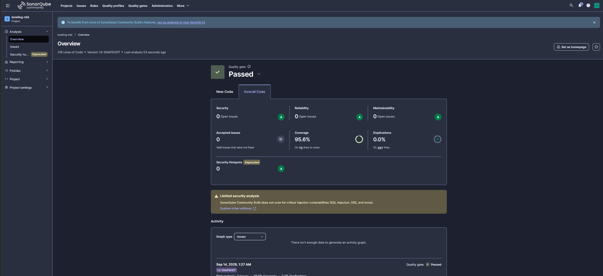

# Bowling TDD — Taller #1 Corte 2 — DOSW 2026-2

## 1. Identificación

- **Nombre completo:** Juan Diego Valderrama Gaviria
- **Código estudiantil:** 1000095092
- **Correo institucional:** Juan.valderrama-g@mail.escuelaing.edu.co

## 2. Descripción

BowlTech S.A.S. quiere digitalizar el sistema de puntuación de sus pistas de bolos, hoy llevado a mano y propenso a errores (bonos de strike olvidados, spares confundidos, mal conteo del juego perfecto). Este proyecto implementa el motor de puntuación de un juego de Bowling para un jugador, siguiendo las reglas oficiales:

| Situación | Condición | Puntuación |
|---|---|---|
| Tiro normal | Derriba algunos pinos sin completar 10 | Solo los pinos derribados en ese tiro |
| Spare | Derriba los 10 pinos en 2 intentos | 10 + primer tiro del siguiente frame |
| Strike | Derriba los 10 pinos en el primer intento | 10 + suma de los dos tiros siguientes |
| Frame 10 | Si hay strike o spare | Hasta 3 tiros en el frame |
| Juego perfecto | 12 strikes consecutivos | 300 puntos |

### Responsabilidades de cada clase

- **`BowlingGame`**: puerta de entrada del sistema. Recibe los tiros , valida su rango y las reglas del frame activo, avanza de frame automáticamente.
- **`Frame`**: representa un frame individual y sus tiros. Sabe si está completo, si es strike o spare, y valida qué tiros puede aceptar según si es un frame regular (1-9) o el frame 10 (reglas especiales de hasta 3 tiros).
- **`FrameType`**: enum que clasifica un frame como NORMAL, SPARE, STRIKE o TENTH.
- **`BowlingScorer`**: clase estática y sin estado que recibe la lista de frames ya jugados y calcula el puntaje total, poniendo todos los tiros en una sola lista y aplicando los bonos de spare y strike mirando hacia adelante.

## 3. Evidencia TDD

El desarrollo completo (22 casos: A1-A8, B1-B8, C1-C6) siguió el ciclo RED → GREEN → REFACTOR, documentado commit por commit en el historial de git de la rama feature/ValderramaJuan_bowling.

Ciclo completo documentado — caso A4 (dos tiros de un mismo frame no pueden sumar más de 10 pinos):

**RED** — el test espera IllegalArgumentException en el segundo tiro, pero la validación aún no existe:

**GREEN** — tras agregar la validación mínima en roll(), las 22 pruebas pasan:

**REFACTOR** — se eliminó el campo currentFrame en BowlingGame, del esqueleto inicial del taller pero nunca utilizado una vez que el frame activo se maneja accediendo directamente. Las 22 pruebas siguieron pasando exactamente igual después del cambio, confirmando que era una limpieza segura sin efectos en el comportamiento observable.

## 4. JaCoCo

- **Resultado:** la cobertura superó el 85% exigido desde la primera ejecución de mvn clean verify, gracias a que los 22 casos de prueba requeridos por el taller ya ejercitan la totalidad de las ramas de negocio de BowlingGame, Frame y BowlingScorer.
- **Captura:**

- **Explicación:** no hubo una versión "antes" con baja cobertura que mejorar — al escribir cada test siguiendo estrictamente TDD, la cobertura de líneas y ramas se construyó de forma  junto con la implementación, en vez de agregarse después para tapar huecos.

## 5. SonarQube

- **Captura:**

- **Quality Gate:** Passed
- **Cobertura:** 95.6% (73 líneas a cubrir)
- **Duplicación:** 0.0%
- **Ratings:** Security A, Reliability A, Maintainability A
- **Issues:** 0 abiertos

## 6. Pull Requests

| PR | Módulo | Estado |
|---|---|---|
| [#1](https://github.com/juandivg26/-DOSW-Taller2-Bowling-Valderrama-Juan/pull/1) | Módulo A — `BowlingGame.roll()` | Merged a `develop` |
| [#2](https://github.com/juandivg26/-DOSW-Taller2-Bowling-Valderrama-Juan/pull/2) | Módulo B — `BowlingScorer.calculate()` | Merged a `develop` |
| [#3](https://github.com/juandivg26/-DOSW-Taller2-Bowling-Valderrama-Juan/pull/3) | Módulo C — `isComplete()` + evidencias JaCoCo/SonarQube | Merged a `develop` |

## 7. Reflexión

**01. ¿Qué caso edge del Bowling fue el más difícil de implementar con TDD y por qué?**

El caso del frame 10 con strike fue el más difícil. La lógica que ya tenía funcionando decía "un frame termina cuando lleva 2 tiros, o 1 tiro si fue strike" eso funcionaba perfecto para los frames 1 al 9, pero el frame 10 tiene reglas distintas: si sacas strike o spare ahí, te ganas tiros extra (hasta 3 en total). Tuve que rehacer esa parte para que el frame 10 supiera manejar sus propias reglas por separado.

**02. ¿Qué parte del código cambió durante REFACTOR sin modificar el comportamiento observable?**

Había una variable que quedó del molde inicial del taller y que nunca terminé usando, porque encontré otra forma más simple de saber en qué frame iba el juego. La quité para dejar el código más limpio, y confirmé que las 22 pruebas seguían pasando exactamente igual es decir, el juego se comporta idéntico para quien lo usa, solo que por dentro quedó más ordenado.

**03. ¿Qué casos de prueba descubriste al revisar el reporte de cobertura de JaCoCo que no habías considerado antes?**

No aparecieron casos nuevos que se me hubieran escapado, porque supe manejar el tiempo emepce el taller con tiempo y dedique un dia para cada parte (A, B y C) para no estra corriendo y pue segui el TDD

**04. ¿Qué hallazgo de SonarQube produjo un cambio real en el código?**

Ninguno cuando corrí el análisis, salió todo limpio a la primera: sin errores, sin código repetido, y con la cobertura de pruebas muy por encima de lo pedido. Creo que se debe a que fui construyendo el código poco a poco, escribiendo solo lo necesario para pasar cada prueba, en vez de escribir todo de una vez y luego intentar arreglarlp que fue lo que me aconsejo el proefe
